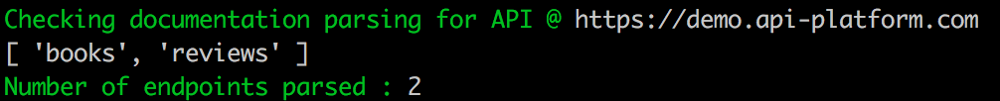

# API-Platform Documentation parsing check

Simple CLI app to check your API-Platform api documentation prior running front-end tools:
1. @api-platform/client-generator
2. @api-platform/admin

This tool is using @api-platform/api-doc-parser library that front-end tools depend on.

Usage:
1. clone repo
2. yarn
3. yarn build
4. ./lib/index.js

Check Result

